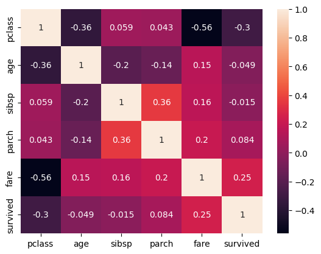
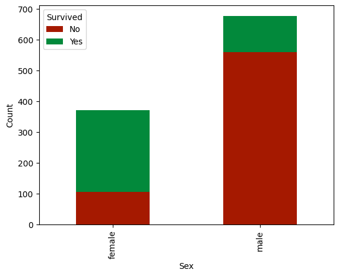

# Ethics, Fairness, and Explanation in AI

This project investigates fairness and interpretability in machine learning models. It focuses on analyzing trade-offs between accuracy, fairness, and explainability using methods such as SHAP, DeepLIFT, and counterfactual explanations. The study is applied to real-world datasets, including the Titanic and Dry Bean datasets, and emphasizes computational efficiency, infidelity, and model fairness.

## Key Findings

### Fairness Analysis
- **Most Impactful Features (Titanic Dataset):**
  - Survival is highly correlated with fare (positive) and class (negative).  
    
  - Gender (being female) is a critical determinant of survival.  
    
- **Fairness Metrics:**
  - Models with fairness constraints demonstrated reduced bias but required trade-offs in accuracy.

### Explainability Techniques
- **SHAP:** 
  - Comprehensive but computationally intensive.
  - Provides detailed feature importance and interactions but becomes less reliable under higher noise scales.
- **DeepLIFT:** 
  - Highly computationally efficient and robust to perturbations, offering stable explanations across conditions.
- **Shapley Value Sampling (SVS):**
  - Faster than SHAP but less detailed in feature interactions.

### Counterfactual Explanations
- **Nearest-Neighbor Counterfactual Explainer (NNCE):**
  - Validity: 0.81±0.097
  - Plausibility: 0.122±0.019
- **Wachter et al.'s Method (WAC):**
  - Perfect validity (1.0±0.0) and higher plausibility scores, demonstrating more realistic changes in features.

## Repository Contents

### Files
- **`Explanation_in_AI_Report.pdf`**:
  - Detailed findings on fairness, explainability methods, and counterfactual explanations.
  - Quantitative evaluation of feature attributions using infidelity and computational efficiency metrics.
  - Analysis of trade-offs in fairness and model performance.

- **`Explainability_CW.ipynb`**:
  - Jupyter Notebook implementing:
    - SHAP, DeepLIFT, and SVS for feature attributions.
    - Counterfactual explanation methods (NNCE and WAC).
    - Preprocessing for Titanic and Dry Bean datasets.
    - Quantitative evaluation of explanation techniques.

## Usage

### Prerequisites
Install the required Python libraries:
```bash
pip install numpy pandas matplotlib scikit-learn shap
```

### Running the Notebook

1. Open `Explainability_CW.ipynb` in Jupyter Notebook.
2. Follow the steps to preprocess data, implement explanation methods, and analyze the results.
3. Modify hyperparameters and perturbation settings to explore the trade-offs between accuracy, fairness, and interpretability.

### Report

Refer to `Explanation_in_AI_Report.pdf` for a detailed discussion of methodologies, results, and insights.

## Key Metrics

### Titanic Dataset

| Method      | Runtime (seconds) | Mean Infidelity | Plausibility |
|-------------|--------------------|-----------------|--------------|
| **SHAP**    | 33.990             | 0.277           | -            |
| **DeepLIFT**| 0.020              | 0.260           | -            |
| **SVS**     | 0.098              | 0.291           | -            |

### Counterfactual Explanations

| Method | Validity        | Cost           | Plausibility    |
|--------|-----------------|----------------|-----------------|
| NNCE   | 0.81±0.097     | 1.076±0.393    | 0.122±0.019     |
| WAC    | 1.0±0.0        | 0.827±0.319    | 0.296±0.083     |

## References

1. Shrikumar, A., Greenside, P., & Kundaje, A. (2019). Learning important features through propagating activation differences.
2. Wachter, S., Mittelstadt, B., & Russell, C. (2018). Counterfactual explanations without opening the black box: Automated decisions and the GDPR.
